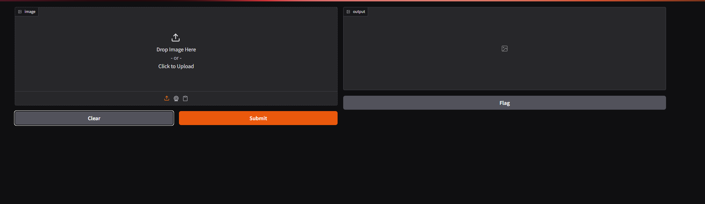
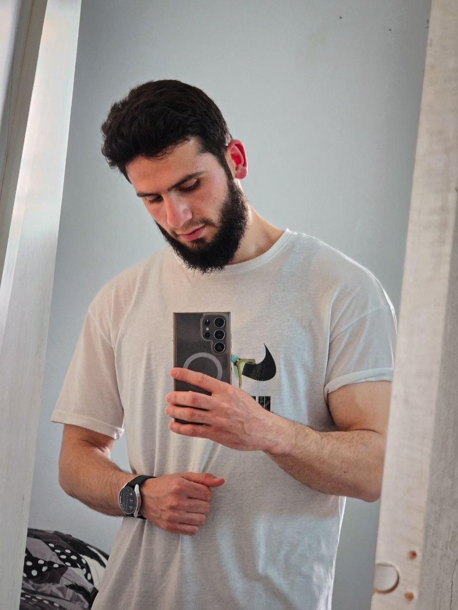
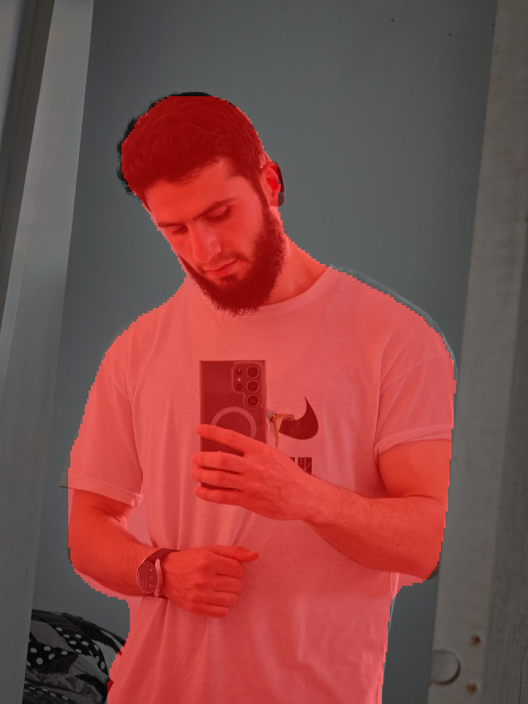
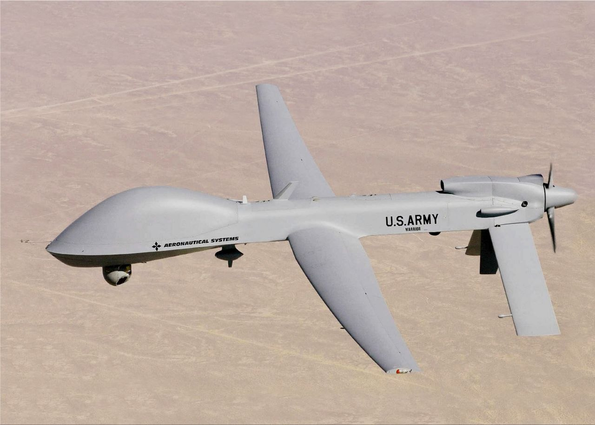
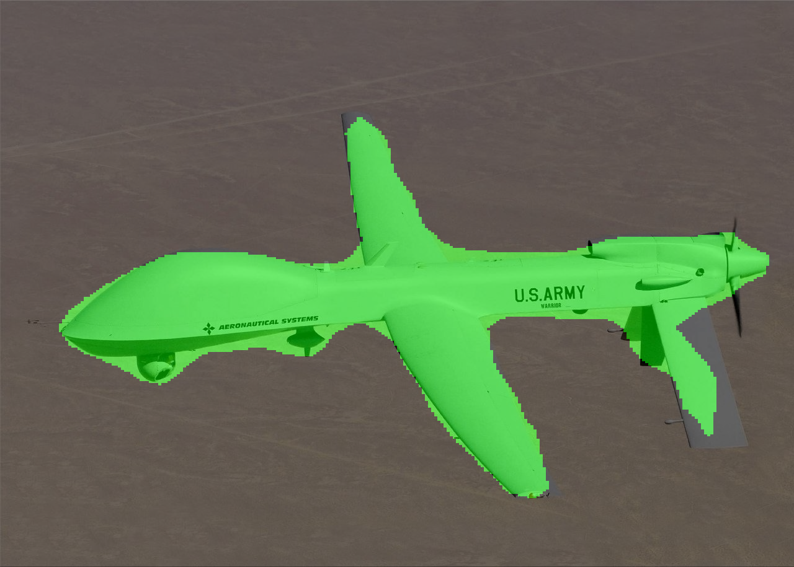

# UrbanSeg AI 🚗🧍✈️

A semantic segmentation system for urban scene understanding, built with PyTorch and DeepLabV3+.

---

## Overview

UrbanSeg AI performs **pixel-level classification** of images into three categories:

| Class | Label | Color |
|-------|-------|-------|
| Background | 0 | ⬛ Black |
| Person | 1 | 🔴 Red |
| Vehicle (cars, buses, trains, planes...) | 2 | 🟢 Green |

Unlike object detection (bounding boxes), semantic segmentation assigns a class to **every single pixel** in the image — enabling fine-grained scene understanding.

---

## Architecture

| Component | Choice | Reason |
|-----------|--------|--------|
| **Model** | DeepLabV3+ | Strong segmentation performance, well-documented |
| **Backbone** | ResNet50 (pretrained) | Transfer learning from ImageNet |
| **Dataset** | PASCAL VOC 2012 | 1,464 train / 1,449 val images |
| **Loss** | CrossEntropyLoss (ignore_index=255) | Standard for segmentation |
| **Optimizer** | SGD + Differential LR | Backbone: 1e-4 / Classifier: 1e-2 |
| **Scheduler** | CosineAnnealingLR | Smooth LR decay |

---

## Results

Trained for 20 epochs on PASCAL VOC 2012 (3-class subset):

| Metric | Value |
|--------|-------|
| Train Loss | 0.0891 |
| Validation Loss | 0.0855 |
| Background IoU | 0.9737 |
| Person IoU | 0.8079 |
| Vehicle IoU | 0.8048 |
| **mIoU** | **0.8621** |

## Demo Screenshots

### Person Segmentation
<table>
  <tr>
    <td></td>
    <td></td>
  </tr>
  <tr>
    <td align="center">Original</td>
    <td align="center">Segmentation</td>
  </tr>
</table>
### Vehicle Segmentation  
<table>
  <tr>
    <td></td>
    <td></td>
  </tr>
  <tr>
    <td align="center">Original</td>
    <td align="center">Segmentation</td>
  </tr>
</table>

---

## Project Structure

```
UrbanSeg-AI/
├── data/                  # Dataset (not tracked by git)
├── src/
│   ├── dataset.py         # PASCAL VOC dataset loader + class remapping
│   ├── augment.py         # Albumentations augmentation pipeline
│   ├── model.py           # DeepLabV3+ model definition
│   ├── train.py           # Training + validation loop
│   ├── evaluate.py        # Evaluation metrics
│   └── predict.py         # Inference + visualization
├── app/
│   └── demo.py            # Gradio web interface
├── outputs/
│   └── weights/           # Saved model checkpoints (not tracked by git)
├── config.yaml            # All hyperparameters
├── requirements.txt       # Dependencies
└── README.md
```

---

## Installation

```bash
# 1. Clone the repository
git clone https://github.com/your-username/UrbanSeg-AI.git
cd UrbanSeg-AI

# 2. Create and activate a virtual environment (recommended)
conda create -n urbansegai python=3.10
conda activate urbansegai

# 3. Install dependencies
pip install -r requirements.txt
```

> ⚠️ **Windows users:** If you encounter a PyTorch DLL error (`WinError 1455`), increase your system's Virtual Memory (Paging File) to at least 16GB.

---

## Dataset Setup

Download PASCAL VOC 2012 Segmentation data from Kaggle:

```
https://www.kaggle.com/datasets/sovitrath/voc-2012-segmentation-data
```

Place the data under:
```
data/
└── row/
    ├── train_images/
    ├── train_labels/
    ├── valid_images/
    └── valid_labels/
```

---

## Training

```bash
python src/train.py
```

All hyperparameters are controlled via `config.yaml`.

Best model checkpoint is saved automatically to `outputs/weights/best_model.pth` whenever validation mIoU improves.

---

## Demo

```bash
python app\demo.py
```

Opens a Gradio web interface at `http://127.0.0.1:7860` — upload any image and get a segmentation overlay instantly.

---

## Key Design Decisions

- **Palette mask reading:** PASCAL VOC masks must be read with PIL without `.convert()` to preserve raw class indices (0–20, 255). Using OpenCV or PIL color conversion corrupts indices via luminance calculation.
- **Differential learning rates:** Pretrained backbone uses `lr=1e-4` while the new classifier head uses `lr=1e-2`.
- **ignore_index=255:** Boundary pixels (void class) are excluded from both loss computation and mIoU calculation.
- **Synchronized augmentation:** Albumentations ensures geometric transforms (flip, rotate, crop) are applied identically to both image and mask.

---

## Future Work

- [ ] Phase 2: SegFormer comparison experiment (hypothesis-driven, controlled)
- [ ] Phase 3: Weighted CrossEntropyLoss for class imbalance
- [ ] Phase 4: Publish model to HuggingFace Hub

---

## Educational Note

This project was built as a **learning exercise** in computer vision and deep learning engineering. The focus was on understanding the full pipeline — from raw data to a working demo — rather than achieving state-of-the-art results.
